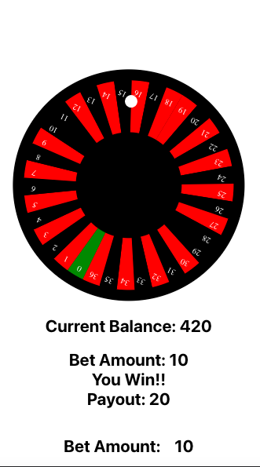
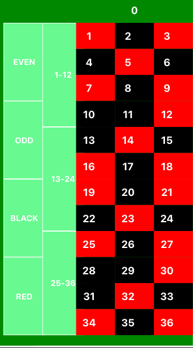

# Roulette App

The Roulette project is a web application that allows users to visualize data and play a game of roulette. This project required a solid understanding of mathematics, as well as skills in programming and web development.




In terms of software design, the project incorporates several key concepts such as Domain Driven Design (DDD), proper folder structure, container patterns, custom hooks, and the Context API. These patterns and technologies were used to create a scalable, maintainable, and extensible codebase.


The project's folder structure is organized around its core domain concepts, and uses container patterns to separate concerns and improve modularity. The Context API and custom hooks were used to manage state and logic, making the application easier to reason about and test.

Overall, the Roulette project demonstrates how applying good software design principles and using modern web development tools can result in a high-quality and enjoyable user experience.

### Usage
To start the development server, run the following command:

```
yarn start
```
This will start the development server at http://localhost:3000. Open this URL in your browser to play the game.

## How to Play
To play the game, you can place bets on the different fields and then press the "Place Bet" button to confirm your bet. The roulette wheel will then spin and if the ball lands on one of the fields you bet on, you win!

## Future Improvements:

As for features, there are many options to enhance the game. For example, you could add multimedia elements such as sound effects or animations to make the game more engaging. Additionally, you could work on improving the visualization of the spinning ball or add different game modes for players to try out. The possibilities are endless!

## Contributing

Contributions are welcome! Feel free to fork the repository and submit pull requests.
